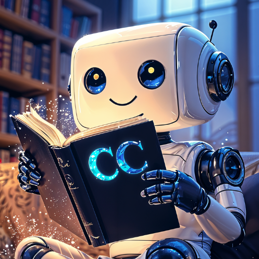

# 🎙️📝 ChatterCraft

<p align="center">
  
</p>

<a href="https://buymeacoffee.com/cmpcreativn" target="_blank">
  
</a>

**ChatterCraft** AI is a Python application that combines an LLM for story generation with Text-to-Speech (TTS) synthesis, featuring voice cloning capabilities. Users can generate unique stories based on prompts or provide their own text, and then bring these narratives to life with customizable speech outputs.

---

## 🚀 Features

- **Dual Story Modes** AI generated or User provided text
- **Advanced Text-to-Speech** Utilizes ChatterBox for high-quality voice cloning
- **Interactive Editing & Regeneration** dit the generated or provided story text directly in the UI
- **User-Friendly Interface** Built with Gradio for an intuitive web-based experience
- **Efficient Model Management** Downloads models on first run and caches them locally
- **Text Processing**– Basic spell checking and punctuation correction for AI-generated stories
- **Audio Output:** Download option for the final `.wav` audio file.

---

## Requirements

* Python 3.8+
* PyTorch (CPU or GPU version, matching your system)
* CUDA (Recommended for GPU acceleration of LLM and TTS)

---

## 🛠️ Installation 

**Clone the repository (if applicable) or download the `app.py` and `requirements.txt` files.**

**Create and activate a virtual environment (recommended):**
    ```bash
    python -m venv venv
    source venv/bin/activate  # On Windows: venv\Scripts\activate
    ```

---


### ✅ Step 1: Upgrade pip

```bash
pip install --upgrade pip
# or
python.exe -m pip install --upgrade pip
```

---

### ✅ Step 2: Install PyTorch

Choose the appropriate command for your system. For full compatibility, refer to: [https://pytorch.org/get-started/locally](https://pytorch.org/get-started/locally)

#### 🖥️ For GPU (NVIDIA CUDA):

**Example for CUDA 11.8:**
```bash
pip install torch torchvision torchaudio --index-url https://download.pytorch.org/whl/cu118
```

**Example for CUDA 12.1 or later:**
```bash
pip install torch torchvision torchaudio --index-url https://download.pytorch.org/whl/cu121
```

**Also tested and working:**
```bash
pip install torch torchvision torchaudio --index-url https://download.pytorch.org/whl/cu128
```

#### 🧠 For CPU-only (Linux, Windows, macOS):

```bash
pip install torch torchvision torchaudio
```

---

### ✅ Step 3: Install Dependencies

```bash
pip install bitsandbytes>=0.43.0
```

---

### ✅ Step 3a: Install dependencies

```bash
pip install -r requirements.txt
```

---

### ✅ Step 4: Additional packages

**Download NLTK `punkt` tokenizer data:**
    The application attempts to do this automatically. If it fails or you want to do it manually, run:
    ```bash
    python -c "import nltk, os; nltk_data_path = os.path.join(os.getcwd(), 'nltk_data'); os.makedirs(nltk_data_path, exist_ok=True); nltk.data.path.append(nltk_data_path); nltk.download('punkt', download_dir=nltk_data_path, quiet=True); print('NLTK punkt downloaded to', nltk_data_path)"
    ```
    This will create an `nltk_data` folder in your application's directory and download the `punkt` resource there.

## Usage

1.  **Navigate to the directory containing `app.py`.**
2.  **Run the application:**
    ```bash
    python app.py
    ```
3.  **Open your web browser and go to `http://localhost:7861` (or the URL shown in the terminal).**


### How to Use the Interface:

1.  **Choose Story Source:**
    * **Generate story with AI:**
        * Enter a creative **Story Prompt** (e.g., "A curious robot discovers a hidden garden on Mars.").
        * Adjust the **Approx. Target Story Duration** slider. This influences the target word count for the AI.
        * The **LLM Model** field displays the model used for generation (`microsoft/Phi-3-mini-4k-instruct`).
    * **Use my own story text:**
        * The prompt and duration settings will be disabled.
        * You will type or paste your story directly into the "Story Text (Editable)" box after the interface loads.

2.  **Configure Voice Settings (TTS):**
    * **(Optional) Voice Sample for Cloning:** Upload a `.wav` or `.mp3` audio file (5-30 seconds of clear, single-speaker speech without much background noise) to clone the voice. If no sample is provided, a default voice will be used.
    * **TTS Variation:** Adjust the slider for more (`1.0`) or less (`0.1`) randomness in speech pitch and tone.
    * **TTS Emotion:** Control the level of expressiveness, from subtle (`0.0`) to more dramatic (`1.0`).

3.  **Generate:**
    * Click the **"🚀 Generate Story & Audio"** button.
    * The "Status Log" will show progress.
    * The AI-generated story (if applicable) will appear in the "Story Text (Editable)" box.
    * The "Generated Audio Output" player will load the synthesized speech.
    * A download link for the `.wav` file will appear under "Download Generated Audio File".

4.  **Edit and Regenerate (Optional):**
    * Modify the text in the "Story Text (Editable)" box.
    * Click the **"🔁 Regenerate Audio from Textbox"** button to synthesize speech from the edited text using the same voice settings.

## Model Information

* **Language Model (LLM):**
    * **Model:** `microsoft/Phi-3-mini-4k-instruct`
    * **Source:** Hugging Face Model Hub
    * **Function:** Generates the story text based on user prompts.
    * Models are downloaded to a `./models` subdirectory.
* **Text-to-Speech (TTS) Model:**
    * **Model:** `ResembleAI/chatterbox`
    * **Source:** Hugging Face Model Hub (via `chatterbox-tts` library)
    * **Function:** Converts text to speech, with voice cloning capabilities.
    * TTS models are downloaded by the `chatterbox-tts` library, typically to `~/.cache/chatterbox`.

## Notes & Troubleshooting

* **First Run:** The initial launch will take longer as the LLM and TTS models need to be downloaded (several gigabytes). Subsequent launches will be faster.
* **Resource Usage:** LLMs and TTS models can be computationally intensive. A system with a dedicated NVIDIA GPU (with at least 6-8GB VRAM for Phi-3 mini, more for larger models if configured) is recommended for optimal performance. CPU-only mode is supported but will be significantly slower.
* **Voice Cloning Quality:** The quality of the cloned voice heavily depends on the clarity, length, and acoustic environment of the uploaded voice sample. Ensure the sample has minimal background noise and clear speech.
* **CUDA Errors:** If you encounter CUDA-related errors:
    * Ensure your NVIDIA drivers are up to date.
    * Verify that your PyTorch installation matches your CUDA version.
    * Check if your GPU has enough memory.
* **NLTK Download Issues:** If automatic NLTK download fails (e.g., due to SSL certificate issues on some networks), use the manual command provided in the "Installation" section.
* **Output Files:** Generated audio files are saved by default in an `output` folder created in the same directory as `app.py`.

## Cleanup

The application includes a cleanup routine that attempts to unload models from memory when the script is exited (e.g., via Ctrl+C in the terminal).

---

Enjoy creating unique audio stories with ChatterCraft!

## 🙌 Credits

ChatterCraft is built on top of the amazing work from the open-source community. Special thanks to the following projects and their creators:

- https://github.com/RemmyLee/chattered
- https://huggingface.co/ResembleAI/chatterbox

Please respect the licenses and terms of these projects when using AIraoke. Check their respective repositories for details.

---

## 🧠 Built With Love

ChatterCraft is an experimental tool crafted for creators, story tellers, and TTS enthusiast. Designed to run locally on PC without relying on external APIs. Please note that the output may not always be perfect, as the LLM can vary. I hope ChatterCraft sparks joy!

📎 License

AIraoke is licensed under the MIT License. See the LICENSE file for details. This project incorporates code from Python-Lyric-Transcriber, which is also licensed under the MIT License.
